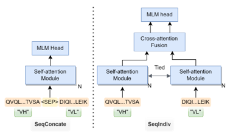
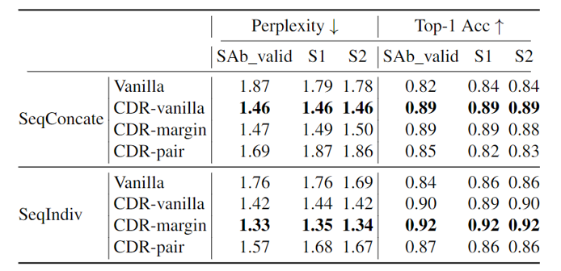

# AbLM
This repo contains the antibody language model used in the paper [Physics-driven structural docking and protein language models accelerate antibody screening and design for broad-spectrum antiviral therapy](https://www.biorxiv.org/content/10.1101/2024.03.01.582176v1)

A series of language models were finetuned for antibody sequences based on a meta in-house protein language model (see "B1" in Table 5 of [this preprint](https://www.ncbi.nlm.nih.gov/pmc/articles/PMC10418537/)) pre-trained over 12 million pfam domain sequences (RP15). The input is composed of paired variable regions from heavy and light chains of the antibody. Since the pre-trained PLM only admits single chain inputs, two strategies were applied to facilitate double chain inputs:

1. "seqConcate": concatenate a set of paired VH and VL sequences into a single sequence with a special token `<SEP>`.
2. "seqIndiv": utilize two encoders admitting VH and VL sequences respectively. The weights of two encoders are always tied together.



The in-house meta pLM was trained with the Masked Language Modeling objective. For antibody finetuning, we applied three additional antibody specific masking pipelines over CDR regions apart from the original masking:

1. "vanilla": apply the original masking strategy over the whole VH and VL sequences
2. "CDR-vanilla": apply the original masking strategy only within the six CDR regions
3. "CDR-margin": randomly pick one CDR out of six and mask all residues within
4. "CDR-pair": mask all residues within one heavy CDR region one light CDR region.

We seleced the best configuration in the sense of language modeling based on the perplexity over SabDab test set and two other independent test sets



### Data/Model availability
The weights of pre-trained meta pLM, as well as finetuned antibody LMs can be downloaded from this [Zenodo repo](https://doi.org/10.5281/zenodo.10989935). The paired VH-VL sequence set for finetuning is also available.

### Create environment
Use `conda` command and the provided `.yaml` file to create an environment to run models.
```shell
conda env create -f environment.yaml
```

### Finetune meta PLM
Follow the following steps to finetune the meta protein language model over your own antibody paired VH-VL sequence dataset.

1. First download weights of pre-trained meta PLM [pretrained_meta_model.zip](https://zenodo.org/records/10989935), and unzip to a local folder.

2. Prepare your own antibody finetuning sequence dataset. The information of each sample should be stored in key-value format with key definitions below:
```text
"seqVH": str, sequence of the heavy chain variable region,
"seqVL": str, sequence of the light chain variable region,
"entityH": str, self-defined identifier of VH, 
"entityL": str, self-defined identifier of VL,
"cdr1HIdx": List, indices of residues in the CDR-1H region (relative to seqVH),
"cdr2HIdx": List, indices of residues in the CDR-2H region (relative to seqVH),
"cdr3HIdx": List, indices of residues in the CDR-3H region (relative to seqVH),
"cdr1LIdx": List, indices of residues in the CDR-1L region (relative to seqVL),
"cdr2LIdx": List, indices of residues in the CDR-2L region (relative to seqVL),
"cdr3LIdx": List, indices of residues in the CDR-3L region (relative to seqVL),
"subclassH": str, class label of heavy chain. use 'unknown' if cannot specify (refer to `ab_H_subclass` & `ab_L_subclass` in `tokenizers.py` for details)
"subclassL": str, class label of light chain. use 'unknown' if cannot specify (refer to `ab_H_subclass` & `ab_L_subclass` in `tokenizers.py` for details)
```
The whole dataset should be save to `LMDB` format with 0, 1, 2, ... as keys for sample dictionaries. Remember to add one extra record `"num_examples": #` for storing the total number of samples which will be loaded by the script. One can refer to the [Data.zip](https://zenodo.org/records/10989935) for detailed examples. The name of lmdb data file should follow the patter `HL_pair_{split}.lmdb` where `split` can be `train`, `valid`, or `test`.

3. run the command below to finetune the model
```python
conda activate env_ablm
python src/main.py \
  run_train \
  transformer \
  [task] \
  --output_dir='exp/results' \
  --log_dir='exp/logs' \
  --batch_size=32 \
  --data_dir='path_to_data_dir' \
  --from_pretrained 'path_to_model_dir' \
  --train_split='train' \
  --valid_split='valid' \
  --num_train_epochs=100 \
  --learning_rate=1e-4 \
  --mlm_mask_stragy=[mask_strategy] \
  --extra_config_file='/configs/mlm_only.json'
```
* `task` can be `antibody_mlm_seqConcate` or  `antibody_mlm_seqIndiv`
* `mask_strategy` can be `vanilla`, `cdr_vanilla`, `cdr_margin` or `cdr_pair`
* run `python src/main.py run_train --help` for detailed descriptions for other arguments.


